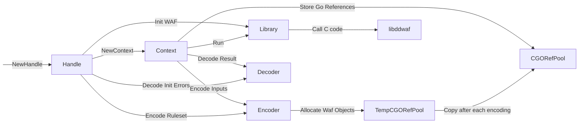

# About
A simple base project showing how to run docker and a vscode debugger plus nodemon

## Initializing
- `git clone git@github.com:arpesam/docker-debugger.git`
- `cd docker-debugger`
- `docker-compose build`
- `docker-compose up`

You can send a `GET` request to `http://localhots:4000`

